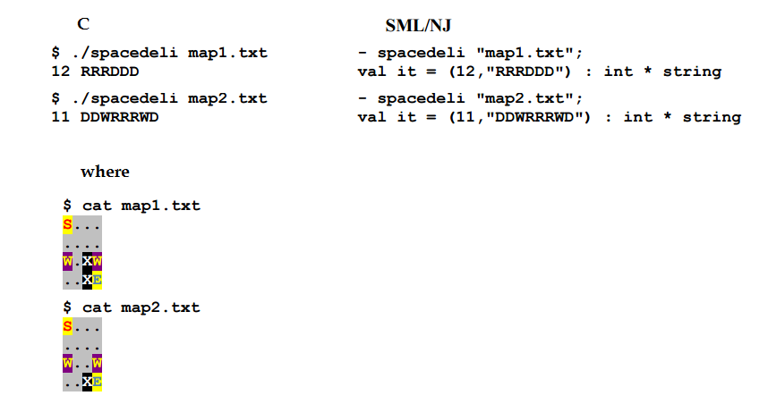

## About
Lakis want to deliver pizza from Starting point 'S' to Ending point 'E'. He can move at every 
square with the exception of 'X' which are obstacles.
'.' are empty spaces and W are Warmholes. In this dimension every move Up/Down/Left/Right costs 2. However Lakis can leave the pizza at 
any warmhole and take it back at any other warmhole
Lakis himself can`t travel inside warmholes, only his pizza. However without his pizza, he moves faster and every move costs only 1. There is
an additional cost of 1 for the time travel of his pizza. Assuming there is always a solution find the fastest one.

## Examples

